# AI Camera SDK — REST API Specification

Local HTTPS control plane for the AI Camera SDK embedded vision system.
Configures pipelines, detectors, masks, outputs, calibration, power
management, firmware updates, remote tunnels, and commercial licensing.
Media capture and delivery (GStreamer, DeepStream, NVIDIA shared memory)
are handled outside this API.

---

## Hardware targets

The SDK runs on heterogeneous embedded hardware. Any board in this list
is a valid target for the control API:

### NVIDIA Jetson Orin Nano

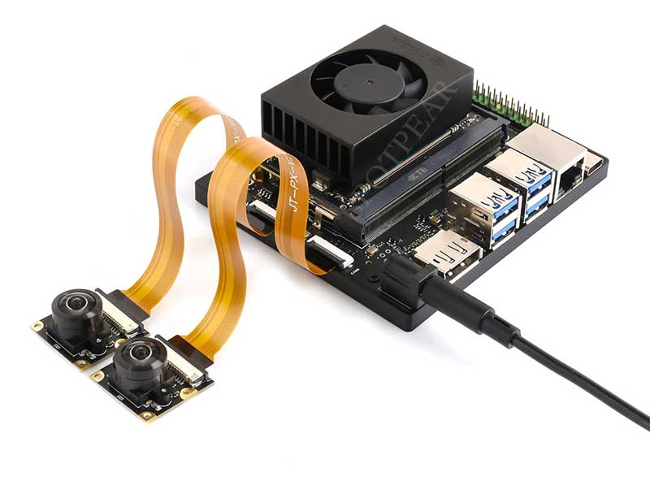
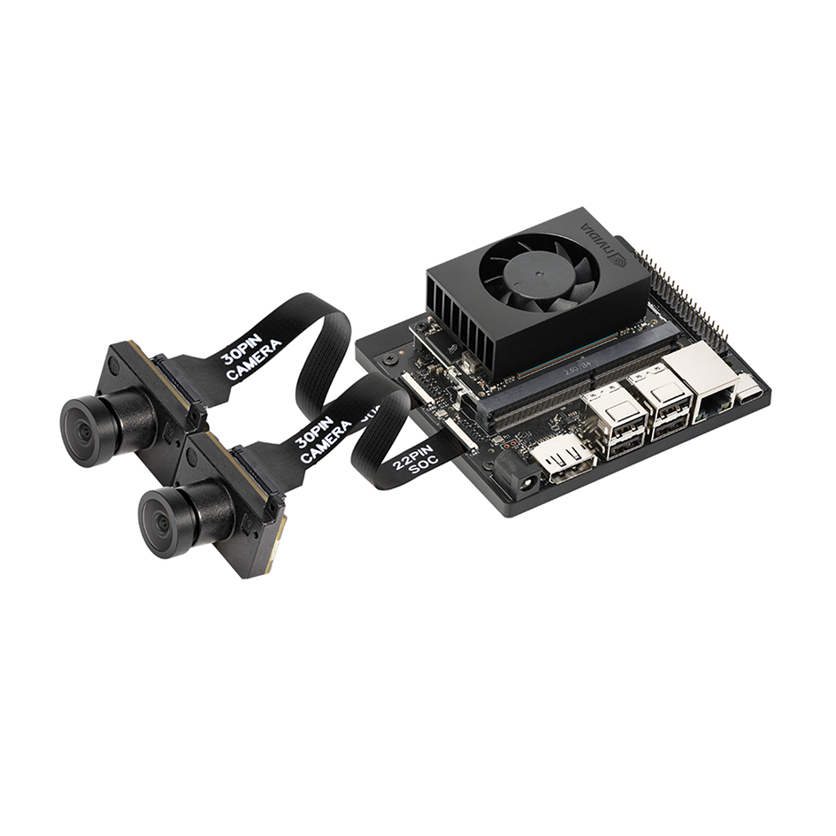

Full NVIDIA accelerator stack: DeepStream, TensorRT, cuDNN.
Supports all three detector types (`face`, `license_plate`, `document`).

### NVIDIA AGX Orin

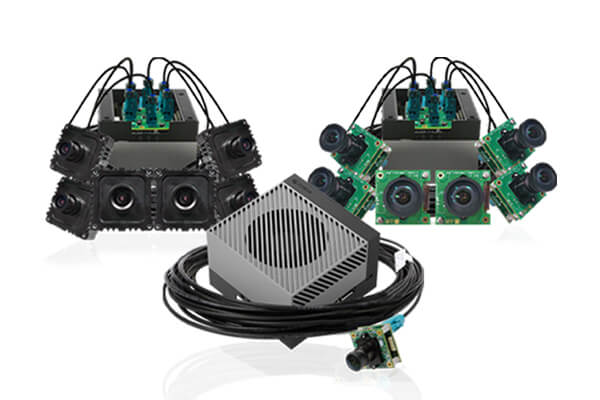

Compact embedded AI computer with a high-performance NVIDIA Ampere-architecture
GPU. Designed for autonomous machines and multi-camera vision applications.
Full accelerator stack; supports all three detector types (`face`,
`license_plate`, `document`). Multiple CSI camera inputs allow simultaneous
multi-stream pipeline processing.

### Raspberry Pi 5 + HAILO

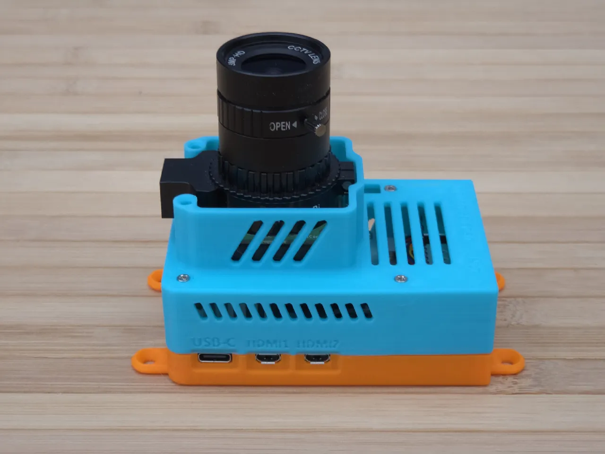

Raspberry Pi 5 with a M.2 HAILO-8L accelerator module.
The HAILO chip runs inference; supported detectors are `face` and
`license_plate`. The `document` detector is not available on this platform.

---

## Repository layout

```
.
├── openapi.yaml              # OpenAPI 3.1 source of truth
├── .spectral.yaml            # Spectral lint ruleset
├── docs/
│   ├── API-DESIGN.md         # Design rationale, auth, errors, WS protocol
│   └── LICENSING.md          # Three-tier licensing rationale
├── examples/                 # End-to-end curl flows (see examples/README.md)
│   ├── 00_env.sh
│   ├── 01_login.sh
│   ├── 02_create_input.sh
│   ├── 03_create_pipeline.sh
│   ├── 04_enable_face_detector.sh
│   ├── 05_add_rectangle_mask.sh
│   ├── 06_add_rtsp_output.sh
│   ├── 07_start_pipeline.sh
│   ├── 08_get_stats.sh
│   └── 09_apply_license.sh
└── images/                   # Hardware board photography
    ├── jetson-orin-nano-01.jpg
    ├── jetson-orin-nano-02.png
    ├── nvidia-agx-orin.jpg
    └── rpi5-inside.webp
```

---

## Quick start

```bash
# 1. Set your board hostname and credentials
export BOARD="camera.local"
export USERNAME="admin"
export PASSWORD="your-password"

# 2. Log in and capture the access token
ACCESS_TOKEN=$(curl -s -k https://${BOARD}/api/v1/auth/login \
  -H 'Content-Type: application/json' \
  -d "{\"username\":\"${USERNAME}\",\"password\":\"${PASSWORD}\"}" \
  | jq -r .access_token)

# 3. Read system info
curl -sk https://${BOARD}/api/v1/system/info \
  -H "Authorization: Bearer ${ACCESS_TOKEN}" | jq .

# 4. Run the full example flow
cd examples && source 00_env.sh && bash 01_login.sh
```

All scripts in `examples/` assume a board reachable over HTTPS with a
self-signed certificate (use `--insecure` or mount your CA cert). See
`examples/README.md` for the complete end-to-end walkthrough.

---

## Workflow guide

A complete walkthrough of every stage from first boot to steady-state
operation. The diagrams use Mermaid syntax; render them in any Mermaid-
aware viewer (GitHub, VS Code, MkDocs, etc.).

---

### 1 — First boot: device identity and network

On first power-up the board starts with a default hostname (`camera.local`
or similar) and a factory-default admin account. Your first tasks are to
verify the device is healthy, set the hostname, configure DNS/NTP, and
apply a static IP if DHCP is not available.

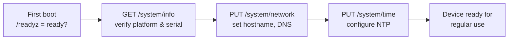

```bash
# Check the board is up and what it is
curl -sk https://${BOARD}/api/v1/system/info | jq '{platform, firmware_version, serial, hostname}'

# Set hostname and DNS
curl -sk -X PUT https://${BOARD}/api/v1/system/network \
  -H "Authorization: Bearer ${ACCESS_TOKEN}" \
  -H "Content-Type: application/json" \
  -d '{"hostname": "gate-camera-01", "dns_servers": ["1.1.1.1", "8.8.8.8"]}'
```

---

### 2 — Apply a commercial license

The board ships unlicensed. Paid features (extra detectors, multi-stream,
SeLink tunnels) are gated by the commercial license. Apply your hardware-
bound key now; without a valid key those features return `409` with
`FEATURE_DISABLED`.

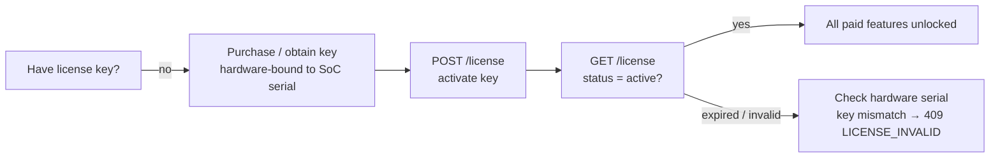

```bash
# Activate — key is writeOnly, never returned again
curl -sk -X POST https://${BOARD}/api/v1/license \
  -H "Authorization: Bearer ${ACCESS_TOKEN}" \
  -H "Content-Type: application/json" \
  -d '{"key": "PASTE-YOUR-HARDWARE-BOUND-KEY"}' | jq .status

# Check what the license actually unlocks
curl -sk https://${BOARD}/api/v1/license/features \
  -H "Authorization: Bearer ${ACCESS_TOKEN}" | jq .features
```

---

### 3 — Register an input source

Inputs are descriptive records about *where* the media comes from. The API
does not configure GStreamer directly — it stores URI/credential metadata
and probes the stream to confirm reachability.

Supported kinds: `usb`, `csi`, `rtsp`, `file`. Credentials for RTSP are
written to an on-device secret store and **never returned** by subsequent
GETs (the URI in the response masks the password as `***`).

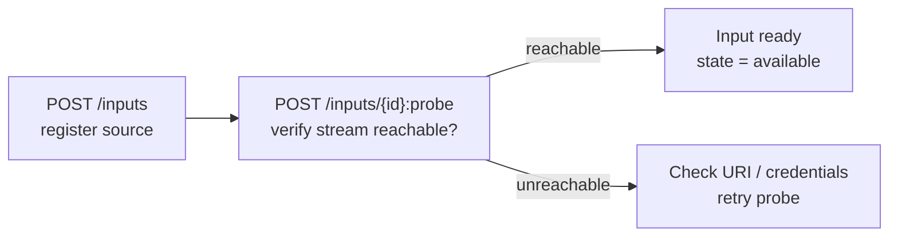

```bash
INPUT_ID=$(curl -sk -X POST https://${BOARD}/api/v1/inputs \
  -H "Authorization: Bearer ${ACCESS_TOKEN}" \
  -H "Content-Type: application/json" \
  -d '{
    "name": "front-gate-rtsp",
    "kind": "rtsp",
    "uri": "rtsp://192.168.1.50:554/stream1",
    "credentials": {"username": "viewer", "password": "s3cret"}
  }' | jq -r .id)

# Probe confirms the stream is reachable and reports detected caps
curl -sk -X POST "https://${BOARD}/api/v1/inputs/${INPUT_ID}:probe" \
  -H "Authorization: Bearer ${ACCESS_TOKEN}" | jq .
```

---

### 4 — Build a pipeline

A **pipeline** is the core resource: it binds one input to a processing
graph (detectors + masks) and one or more outputs. Pipelines are created
in the `stopped` state; they do not start automatically.

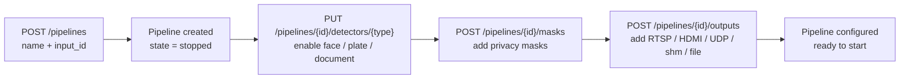

```bash
# Create pipeline
PIPELINE_ID=$(curl -sk -X POST https://${BOARD}/api/v1/pipelines \
  -H "Authorization: Bearer ${ACCESS_TOKEN}" \
  -H "Content-Type: application/json" \
  -d "{\"name\": \"front-gate\", \"input_id\": \"${INPUT_ID}\"}" \
  | jq -r .id)

# Enable face detector
curl -sk -X PUT "https://${BOARD}/api/v1/pipelines/${PIPELINE_ID}/detectors/face" \
  -H "Authorization: Bearer ${ACCESS_TOKEN}" \
  -H "Content-Type: application/json" \
  -d '{"enabled": true, "confidence_threshold": 0.55, "tracking": {"enabled": true}}'

# Add a static privacy mask (blur upper region)
curl -sk -X POST "https://${BOARD}/api/v1/pipelines/${PIPELINE_ID}/masks" \
  -H "Authorization: Bearer ${ACCESS_TOKEN}" \
  -H "Content-Type: application/json" \
  -d '{
    "target": "all", "style": "blur", "strength": 40,
    "follow_detection": false,
    "shape": {"type": "rectangle", "rect": {"x": 0, "y": 0, "w": 1, "h": 0.3}}
  }'

# Add a processed (masked) RTSP output
curl -sk -X POST "https://${BOARD}/api/v1/pipelines/${PIPELINE_ID}/outputs" \
  -H "Authorization: Bearer ${ACCESS_TOKEN}" \
  -H "Content-Type: application/json" \
  -d '{
    "name": "front-gate-out", "kind": "rtsp",
    "content": "processed", "codec": "h264",
    "rtsp": {"url": "rtsp://0.0.0.0:8554/front-gate", "transport": "tcp"}
  }'
```

---

### 5 — Calibrate lens distortion (optional)

If the camera lens introduces significant barrel/pincushion distortion
(wide-angle or entry-level optics), upload checkerboard images and solve
for the intrinsic matrix and distortion coefficients. Apply the resulting
profile to a pipeline so frames are undistorted before detection.

```mermaid
graph LR
    A["POST /calibrations\ncreate profile"] --> B["POST /calibrations/{id}/images\nupload ≥ 10 checkerboard frames"]
    B --> C["POST /calibrations/{id}:compute\nsolve K matrix + distortion"]
    C --> D{"RMS error\nacceptable?"]
    D -->|yes| E["POST /calibrations/{id}:apply\nbind to pipeline"]
    D -->|no| F["Upload more images\nretry compute"]
```

```bash
CAL_ID=$(curl -sk -X POST https://${BOARD}/api/v1/calibrations \
  -H "Authorization: Bearer ${ACCESS_TOKEN}" \
  -H "Content-Type: application/json" \
  -d '{"name": "wide-angle-front", "pattern": {"type": "checkerboard", "cols": 9, "rows": 6, "square_size_mm": 25}}' \
  | jq -r .id)

# Upload 10+ images from different angles
for f in capture_*.png; do
  curl -sk -X POST "https://${BOARD}/api/v1/calibrations/${CAL_ID}/images" \
    -H "Authorization: Bearer ${ACCESS_TOKEN}" \
    -F "image=@${f}"
done

# Solve intrinsics
curl -sk -X POST "https://${BOARD}/api/v1/calibrations/${CAL_ID}:compute" \
  -H "Authorization: Bearer ${ACCESS_TOKEN}" | jq '{intrinsics, rms_error}'

# Apply to pipeline
curl -sk -X POST "https://${BOARD}/api/v1/calibrations/${CAL_ID}:apply" \
  -H "Authorization: Bearer ${ACCESS_TOKEN}" \
  -H "Content-Type: application/json" \
  -d "{\"pipeline_id\": \"${PIPELINE_ID}\"}"
```

---

### 6 — Start and monitor a pipeline

Start is async (202 Accepted). Poll `/pipelines/{id}/status` or subscribe
to the `pipeline.status` WebSocket channel to learn when the pipeline
reaches `running`.

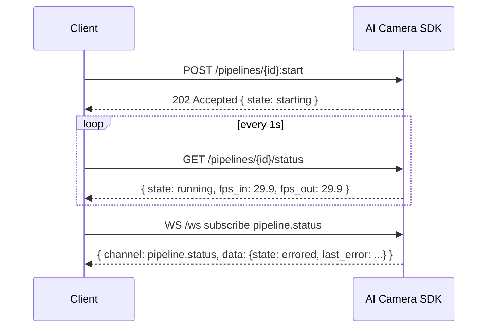

```bash
# Start the pipeline
curl -sk -X POST "https://${BOARD}/api/v1/pipelines/${PIPELINE_ID}:start" \
  -H "Authorization: Bearer ${ACCESS_TOKEN}" | jq .

# Poll until running
for i in $(seq 1 10); do
  STATUS=$(curl -sk "https://${BOARD}/api/v1/pipelines/${PIPELINE_ID}/status" \
    -H "Authorization: Bearer ${ACCESS_TOKEN}" | jq -r .state)
  echo "state=$STATUS"
  [ "$STATUS" = "running" ] && break
  sleep 1
done

# Or subscribe to realtime events
wscat -c "wss://${BOARD}/api/v1/ws?access_token=${ACCESS_TOKEN}" \
  --subprotocol bearer \
  -x '{"op": "subscribe", "channels": ["pipeline.status", "detector.events"]}'
```

---

### 7 — Daily operation: stats, health, power

Once running, poll or subscribe for operational telemetry. For
Prometheus-compatible scrapers, `GET /stats/export?format=prometheus`
returns an exposition text that Prometheus can ingest directly.

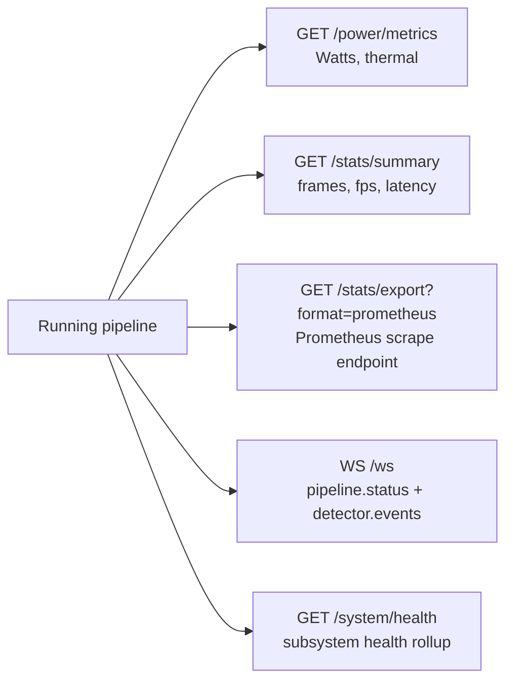

```bash
# Power and thermal
curl -sk https://${BOARD}/api/v1/power/metrics \
  -H "Authorization: Bearer ${ACCESS_TOKEN}" \
  | jq '{instant_watts, thermal: [.thermal[].celsius]}'

# Stats summary
curl -sk https://${BOARD}/api/v1/stats/summary \
  -H "Authorization: Bearer ${ACCESS_TOKEN}" \
  | jq '.lifetime | {frames_in, frames_processed, avg_fps, avg_inference_ms}'

# Prometheus exposition (no jq needed — paste into prometheus.yml scrape target)
curl -sk "https://${BOARD}/api/v1/stats/export?format=prometheus" \
  -H "Authorization: Bearer ${ACCESS_TOKEN}"
```

---

### 8 — Firmware updates and rollback

The device runs an A/B partition scheme. Updates are installed into the
inactive slot; a reboot activates the new slot. Security updates can be
installed without a full reboot.

```mermaid
graph LR
    A["GET /updates/available"] --> B{"Security\nupdates?"]
    B -->|yes, no reboot| C["POST /updates/{id}:install\njob queued"]
    B -->|yes, reboot required| D["POST /updates/{id}:install"]
    D --> E["POST /system/reboot\nactivates new slot"]
    C --> F["GET /updates/jobs/{job_id}\nprogress"]
    F --> G["Job = success?"]
    G -->|no| H["POST /updates/rollback"]
    G -->|yes| I["Running new version"]
```

```bash
# Check what's available
curl -sk https://${BOARD}/api/v1/updates/status \
  -H "Authorization: Bearer ${ACCESS_TOKEN}" \
  | jq '{current_version, security_count, available_count}'

# Install a pending update
UPDATE_ID=$(curl -sk https://${BOARD}/api/v1/updates/available \
  -H "Authorization: Bearer ${ACCESS_TOKEN}" \
  | jq -r '.items[0].id')

JOB_ID=$(curl -sk -X POST "https://${BOARD}/api/v1/updates/${UPDATE_ID}:install" \
  -H "Authorization: Bearer ${ACCESS_TOKEN}" \
  | jq -r .id)

# Follow progress
curl -sk "https://${BOARD}/api/v1/updates/jobs/${JOB_ID}" \
  -H "Authorization: Bearer ${ACCESS_TOKEN}" | jq '{state, progress}'
```

---

### 9 — Regular auth: JWT vs API keys

**Interactive users** (browsing the web portal) use `POST /auth/login`
which returns short-lived JWTs. Refresh before expiry with
`POST /auth/refresh`.

**Machine clients** (automation scripts, headless deployments) should
create a long-lived API key via `POST /auth/api-keys`. The secret is shown
once and never again — store it in your secrets manager immediately.

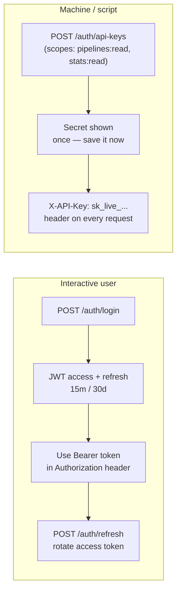

```bash
# Interactive: get JWT
ACCESS_TOKEN=$(curl -sk -X POST https://${BOARD}/api/v1/auth/login \
  -H 'Content-Type: application/json' \
  -d "{\"username\":\"admin\",\"password\":\"your-password\"}" \
  | jq -r .access_token)

# Machine: create scoped API key (save the secret — it won't be shown again)
KEY_RESP=$(curl -sk -X POST https://${BOARD}/api/v1/auth/api-keys \
  -H "Authorization: Bearer ${ACCESS_TOKEN}" \
  -H "Content-Type: application/json" \
  -d '{"name": "prometheus-exporter", "scopes": ["stats:read", "system:read"]}')
API_SECRET=$(echo "$KEY_RESP" | jq -r .secret)
echo "Store this securely: ${API_SECRET}"

# Use the API key in subsequent requests
curl -sk https://${BOARD}/api/v1/stats/export?format=prometheus \
  -H "X-API-Key: ${API_SECRET}" | head -5
```

---

### 10 — Resource dependency summary

When deleting resources, note the dependency chain. A pipeline must be
`stopped` before it can be deleted; an input cannot be deleted while
referenced by a running pipeline.

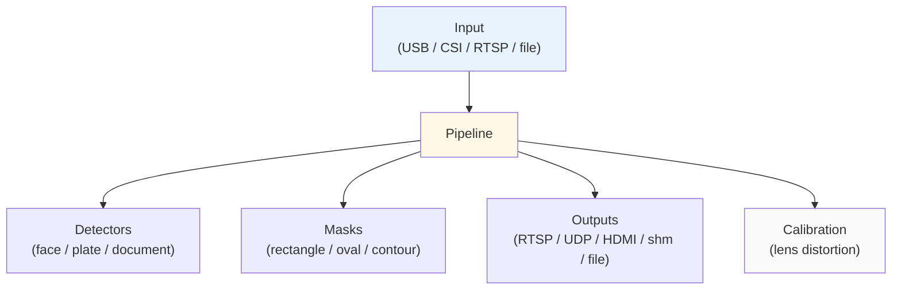

| Action | Prerequisite |
|---|---|
| Delete an input | No pipeline may reference it |
| Delete a pipeline | Pipeline must be `stopped` |
| Delete an output | Pipeline should be `stopped` |
| Apply calibration | Pipeline should be `stopped` |
| Change a detector | Pipeline can be running |
| Enable/disable a mask | Pipeline can be running |

---

### Complete happy-path checklist

```
[ ] Board reachable  → GET /readyz
[ ] Verify identity   → GET /system/info  (check platform + serial)
[ ] Set network       → PUT /system/network
[ ] Activate license → POST /license
[ ] Register input   → POST /inputs  →  POST /inputs/{id}:probe
[ ] Create pipeline   → POST /pipelines
[ ] Configure detector→ PUT /pipelines/{id}/detectors/{type}
[ ] Add masks         → POST /pipelines/{id}/masks
[ ] Add output(s)     → POST /pipelines/{id}/outputs
[ ] Start pipeline    → POST /pipelines/{id}:start  →  state = running
[ ] Verify stats      → GET /stats/summary
[ ] Enable remote access → POST /tunnels  →  POST /tunnels/{id}:connect
[ ] Schedule power    → POST /power/schedules
[ ] Check for updates → GET /updates/available
```

All steps are implemented as ready-to-run scripts in [`examples/`](examples/).

---

## Resource overview

| Group | Resources |
|---|---|
| **Device** | `GET /system/info`, `GET /system/health`, `PUT /system/time`, `PUT /system/network` |
| **Auth** | `POST /auth/login`, `POST /auth/refresh`, `POST /auth/logout`, `POST /auth/password`, `POST /auth/api-keys` |
| **Users & roles** | `GET /users`, `POST /users`, `GET /roles`, `POST /roles`, `GET /audit-log` |
| **Inputs** | `GET /inputs`, `POST /inputs`, `POST /inputs/{id}:probe` |
| **Pipelines** | `GET /pipelines`, `POST /pipelines`, `POST /pipelines/{id}:start`, `POST /pipelines/{id}:stop`, `GET /pipelines/{id}/status` |
| **Detectors** | `GET /detectors/models`, `PUT /pipelines/{id}/detectors/{face\|license_plate\|document}` |
| **Calibration** | `POST /calibrations`, `POST /calibrations/{id}/images`, `POST /calibrations/{id}:compute`, `POST /calibrations/{id}:apply` |
| **Masks** | `POST /pipelines/{id}/masks`, `PATCH /pipelines/{id}/masks/{mask_id}` |
| **Outputs** | `POST /pipelines/{id}/outputs`, `PATCH /pipelines/{id}/outputs/{out_id}` — supports RTSP, UDP, HDMI, shm, file |
| **Power** | `GET /power/metrics`, `GET /power/history`, `PUT /power/policy`, `POST /power/schedules` |
| **Stats** | `GET /stats/summary`, `GET /stats/timeseries`, `GET /stats/export?format=prometheus` |
| **Updates** | `GET /updates/available`, `POST /updates/{id}:install`, `POST /updates/rollback` |
| **Tunnels** | `POST /tunnels`, `POST /tunnels/{id}:connect`, `GET /tunnels/{id}/status` |
| **License** | `POST /license`, `GET /license`, `GET /license/features` |
| **Events** | `GET /events`, `WS /ws` (realtime) |

---

## Key design decisions

- **URI versioning** — `/api/v1/...`
- **RFC 7807 Problem+JSON** — all 4xx/5xx responses, with canonical
  `code` strings (`DETECTOR_UNAVAILABLE`, `HARDWARE_UNSUPPORTED`, etc.)
- **Cursor pagination** — `?limit=…&cursor=…`, `next_cursor` in response
- **ETag + If-Match** — optimistic concurrency on all mutable resources
- **Idempotency-Key** — replay-safe POSTs (create input, pipeline, etc.)
- **JWT + API keys** — interactive users get short-lived JWTs; machines
  use long-lived `X-API-Key` credentials
- **RBAC scopes** — `admin`, `operator`, `viewer`, `service`; fine-grained
  `pipelines:write`, `detectors:read`, etc.
- **Credentials write-only** — RTSP passwords, license keys, API key
  secrets are never returned by GET
- **Realtime** — WebSocket at `WS /ws`; subscribe to `pipeline.status`,
  `power.metrics`, `detector.events`, `updates.jobs`, `tunnels.status`,
  `system.health`

Full details: [`docs/API-DESIGN.md`](docs/API-DESIGN.md)

---

## Licensing

| Artifact | License |
|---|---|
| Firmware / on-device services | Proprietary (commercial EULA) |
| Reference web portal | **AGPL-3.0-only** |
| `openapi.yaml` + `docs/` | **CC-BY-4.0** |
| `examples/` | **CC0-1.0** (public domain) |

Full rationale: [`docs/LICENSING.md`](docs/LICENSING.md)

---

## Validating the spec

```bash
# Install Spectral
npx --yes -p @stoplight/spectral-cli spectral lint openapi.yaml
# Expect: "No results with a severity of 'error' found!"
```

```bash
# Parse YAML only (no external tools needed)
python3 -c "import yaml; yaml.safe_load(open('openapi.yaml'))"
```

---

## OpenAPI tooling

Because the spec is OpenAPI 3.1, it can be used to generate clients,
servers, and documentation with any OpenAPI-capable toolchain:

```bash
# Generate a Python client
npx @openapitools/openapi-generator-cli generate \
  -i openapi.yaml -g python \
  -o ./generated/python

# Generate a TypeScript fetch client
npx @openapitools/openapi-generator-cli generate \
  -i openapi.yaml -g typescript-fetch \
  -o ./generated/ts

# Serve interactive docs
npx @redocly/cli preview-docs openapi.yaml
```
